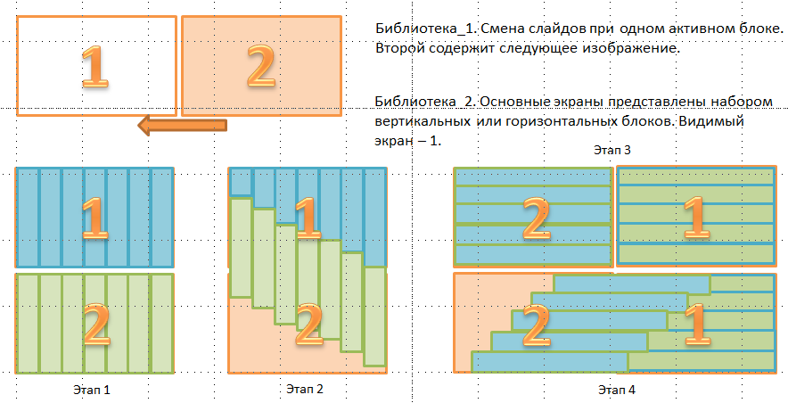
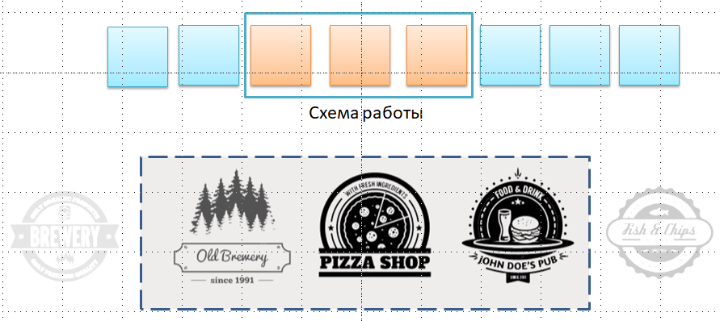
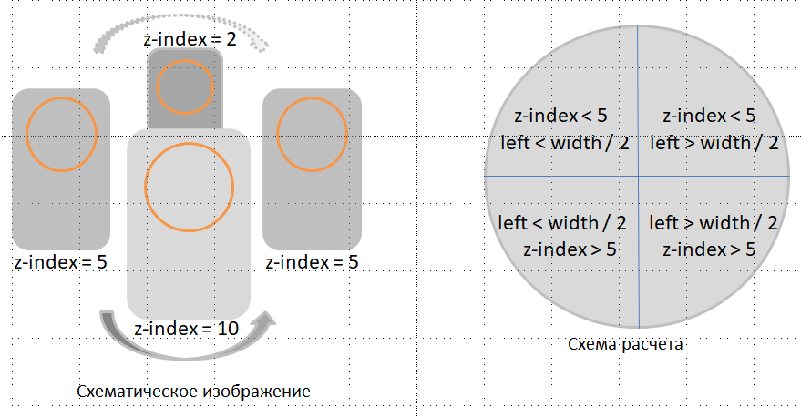
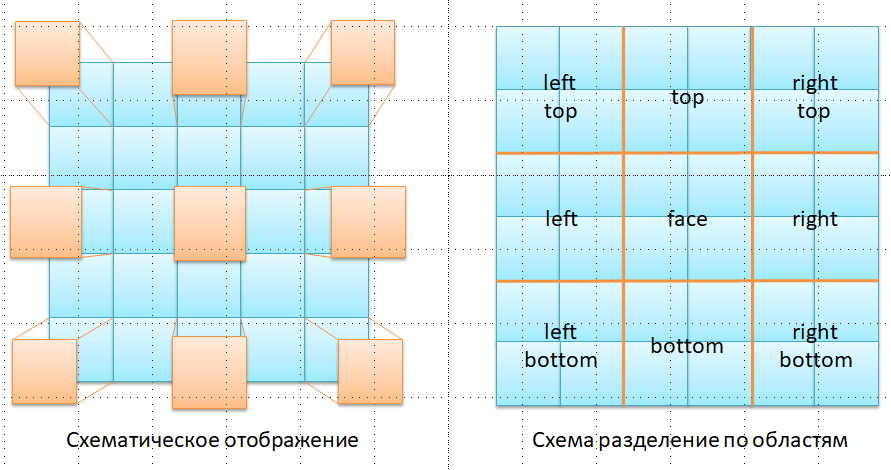

# Одностраничный сайт "Создание собственного ресторанного бизнеса"
## Общая информация
Сайт одностраничный, предназначен для продажи проекта создания собственного ресторанного бизнеса.
Проект работает по схеме франшизы, но без основных сдерживающих факторов данного типа бизнеса:
* открытие бизнеса под торговой маркой клиента
* отсутствие рояли

## Структура сайта
Сайт состоит из 10 блоков
* главный слайдер
* шаги реализации
* цифры проекта
* отзывы клиентов
* галерея
* команда проекта
* знакомство  шеф-поваром
* ценообразование
* клиенты и партнеры
* контакты

## Методы реализации
Реализуемый проект - одностраничный сайт (landing page).
Созданы и используются 7 настраиваемых библиотек.
Используется 1 сторонняя библиотека.

## Подключаемые библиотеки
1. Главный слайдер сайта

2. Карусель логотипов клиентов и партнеров

3. 3D-круговая карусель для отзывов клиентов

4. Галерея. Используется для отображения готовых объектов и блюд из меню

## Содержание библиотеки
Название файла  | Содержание файла
----------------|----------------------
css             | Папка для хранения файлов каскадных таблиц стилей, в котором собраны необходимые стили.
js              | Папка для хранения файлов, в которых содержатся скрипты, написанный на языке JavaScript (ES5).
images          | Папка для хранения изображений проекта
library         | Папка для хранения подключаемых библиотек проекта
video           | Папка для хранения видео файло различных форматов, которое используестя в проекте
fonts           | Папка для хранения шрифтов. Все необходимые шрифты имеюся в структуре проекта
index.html      | Главный файл запуска проекта

## Используемые ресурсы
* [jQuery](http://jquery.com/)
* [Font Awesome](https://fontawesome.com/)
* [Google Fonts](https://fonts.google.com/)
(для более стабильной и автономной работы необходимые шрифты располагаются в соответствующей паке fonts)
* [Странный JavaScript](https://dmitrytinitilov.gitbooks.io/strange-javascript/content/)
* [javascript.ru](https://learn.javascript.ru/)
* [W3Scholls](https://www.w3schools.com/html/)

## Программное обеспечение, используемое в работе
* [Sublime Text Build 3126 x64_custom](https://www.sublimetext.com/)
* [Google Chrome Версия 63.0.3239.132 (Официальная сборка), (64 бит)](https://www.google.ru/chrome/browser/desktop/index.html)
* [Opera 50.0.2762.67 (PGO)](http://www.opera.com/ru)
* [Firefox Quantum 57.0.4 (64-bit)](https://www.mozilla.org/ru/firefox/)
* [Adobe PhotoShop CS6](https://www.adobe.com/ru/products/photoshop.html)
