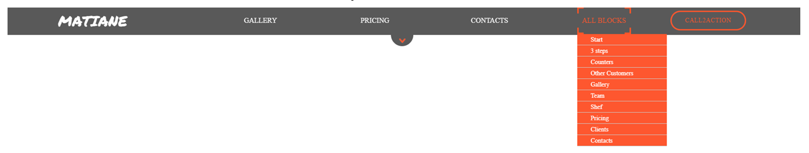

# Библиотека "Menu
## Общая информация
Библиотека предназначена для размещения на сайте меню проекта.
Меню имеет горизонтальное расположение и располагается на всю ширину экрана вне зависимости от диагонали экрана.
Меню имеет фиксированное позиционирование и размещена в верхней части окна.
Меню может содержать как основные пукты, так и подпункты первого уровня, отображающиеся при клике на пункте меню.
Меню через настраиваемый промежуток времени скрывается с основного экрана.

## Используемые ресурсы
* [jQuery](http://jquery.com/)
* [Font Awesome](https://fontawesome.com/)
* [Google Fonts](https://fonts.google.com/)
(для более стабильной и автономной работы необходимые шрифты располагаются в соответствующей паке fonts)
* [Странный JavaScript](https://dmitrytinitilov.gitbooks.io/strange-javascript/content/)
* [javascript.ru](https://learn.javascript.ru/)
* [W3Scholls](https://www.w3schools.com/html/)

## Программное обеспечение, используемое в работе
* [Sublime Text Build 3126 x64_custom](https://www.sublimetext.com/)
* [Google Chrome Версия 63.0.3239.132 (Официальная сборка), (64 бит)](https://www.google.ru/chrome/browser/desktop/index.html)
* [Opera 50.0.2762.67 (PGO)](http://www.opera.com/ru)
* [Firefox Quantum 57.0.4 (64-bit)](https://www.mozilla.org/ru/firefox/)
* [Adobe PhotoShop CS6](https://www.adobe.com/ru/products/photoshop.html)


## Содержание библиотеки
Название файла  | Содержание файла
----------------|----------------------
menu.css        | Файл каскадной таблицы стилей, в котором собраны необходимые стили.
menu.js         | Файл, в котором содержится скрипт, написанный на языке JavaScript (ES5). Предназначение скрипта - обработка действий пользователей.
img             | Папка для хранения изображений, необходимых для создания меню

## Подключение библиотеки
Для подключения библиотеки необходимо:
1. Файл формата html, в котором необходимо разместить меню (например index.html), доджен содержать тег nav и дочерний блок с классом mainMenu
```html
<body>
 <nav id="nav">
  <div class="mainMenu">
     <!-- здесь будет динамически добавлен код с помощбю скрипта javascrip -->
  </div>
 </nav>
...
</body>
```
2. Сами файлы библиотеки рекомендуется добавлять в проект единой папкой в общей папке library.
Структура проекта может выглядить так:
```html
Project
  library       (папка для размещения библиотек)
    Menu        (библиотека "Menu")
      img       (папка с изображениями для меню)
      menu.css  (таблица стилей)
      menu.js   (скрипт)
    Slider      (библиотека "Slider")
  css
  js
  images
  index.html
```
Пользователь может по своему усмотрению размещать файлы библиотеки, настраивая соответствующие пути к файл.

3. В файле html необходимо прописать соответствующие пути для подключения таблицы стилей и скрипта:
```html
<body>
...
  <link rel="stylesheet" href="library/Menu/menu.css">
...
</body>
```

```html
<body>
...
  <script src="library/Menu/menu.js"></script>
...
</body>
```

## Настройка меню
В скрипте пользователь может настроить:
* количество пунктов основного меню, которое рассчитывается по количеству введенных наименований основных пунктов
```html
var arrMenuItems = ['gallery','pricing','contacts','all blocks']; //Наименования пунктов меню
```
* внутренние ссылки (якоря), активные при клике на основные пункты меню
```html
var arrMenuLinks = ['5','8','11',''];	//Внутренние ссылки меню
```
* количество подпунктов каждого из основного пункта меню
```html 
var arrSubmenuNumItems = [0,0,0,11];	//кол-во подменю пугктов мею
```
* наименования подменю основного меню. Количество наименований должно соответствовать сумме значений по прошлому пукту, т.е. 11 по приведенному примеру
```html 
var arrSubmenuItems = ['Start','3 steps','Counters','Other Customers','Gallery','Team','Shef','Pricing','Clients','Foods','Contacts']; //Наименования пунктоа подменю
```
* внутренние ссылки (якоря), активные при клике
```html
var arrSubmenuLinks = ['#1','#2','#3','#4','#5','#6','#7','#8','#9','#10','#11']; //Ссылки пунктов подменю
```
* Время, через которое меню скрывается с основного экрана. Время указывается в миллискундах (7000 = 7 секунд)
```html
var timeHideMenu = 7000; //интервал скрытия меню
```
